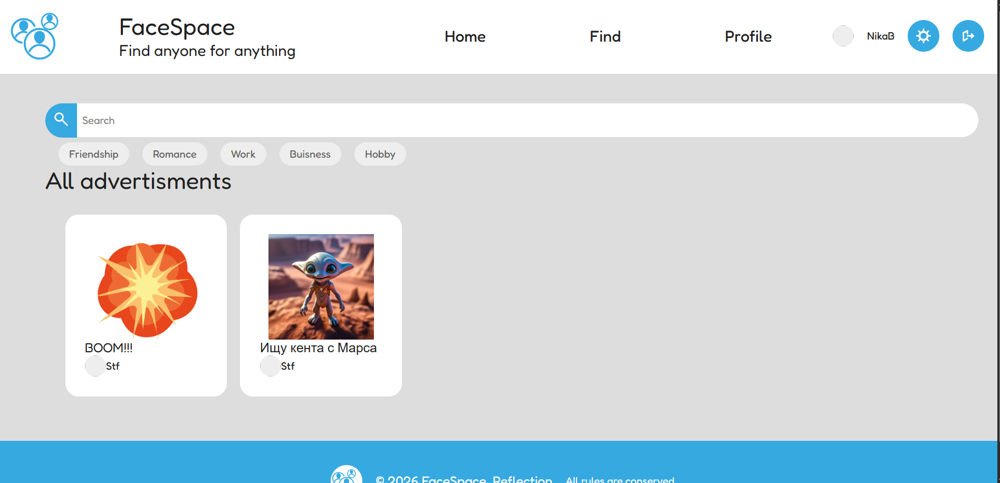
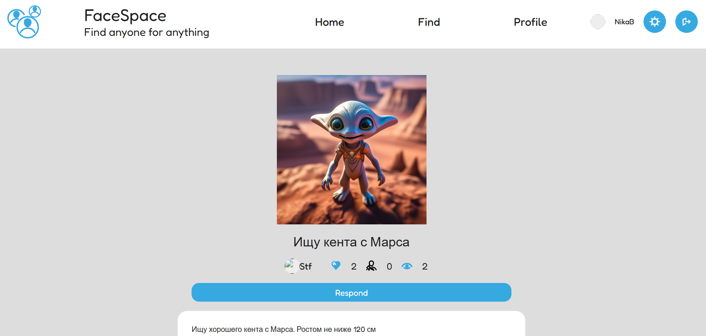
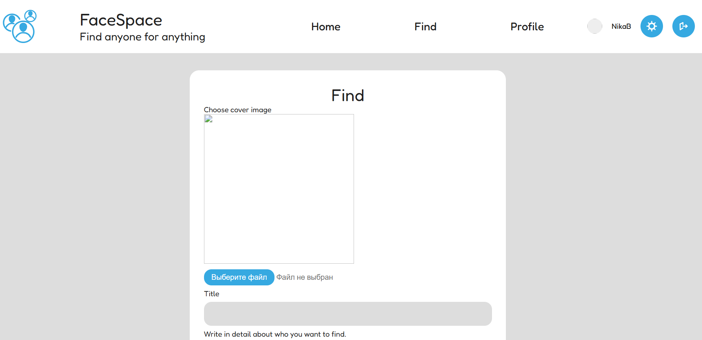
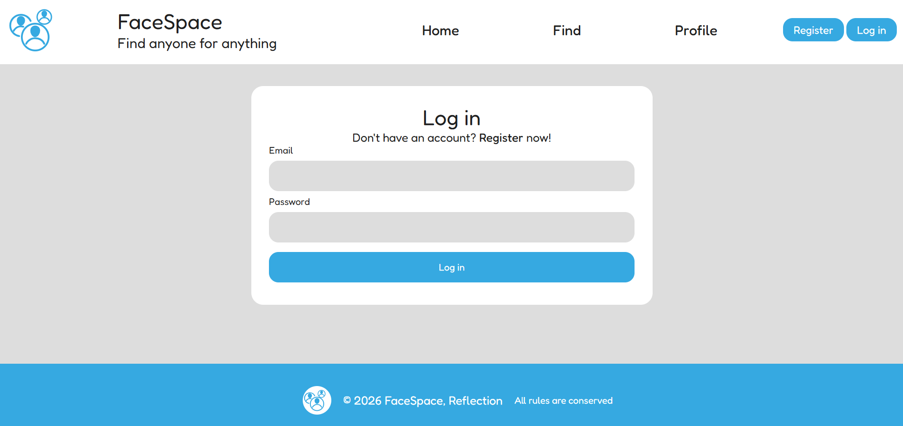
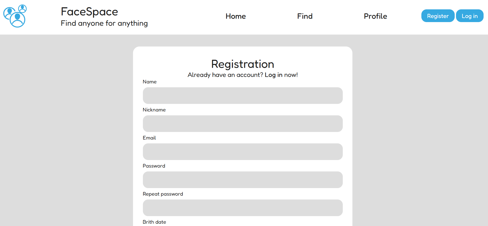
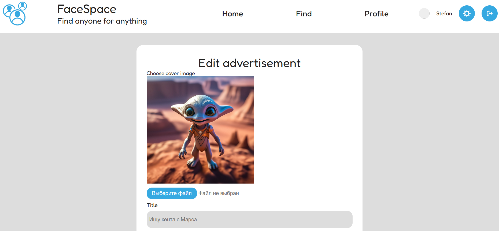

# Разработчики

Бендерский Стефан

# Описание

**FaceSpace** - это уникальная платформа, где ты можешь найти подходящего человека для деловых, дружеских, любовных и
прочего рода встреч.

# Технические задачи

1) При помощи библиотеки flask создать серверное приложение
2) При помощи библиотеки sqlalchemy реализовать взаимодействие с базой данных
3) Добавить модель данных пользователя, объявления, категории объявления, действия
4) Разработать главную страницу сайта
5) Разработать страницу входа и регистрации, а также реализовать регистрацию и вход пользователя на бэкенде.
6) Разработать страницу профиля пользователя.
7) Разработать страницу объявления.
8) Разработать страницу настроек.
9) Добавить возможность создания и редактирования объявления
10) Добавить возможность ставить реакцию на объявление.
11) Добавить систему рекомендаций и систему поиска.

# Релизация проекта

Особенности реализации проекта:

- Серверное приложение и роутинг реализовано в скрипте ***app.py***.
- Данные пользователей хранятся в SQL-базахданных. Взаимодействие с базой данных осуществляется при помощи класса
  ***Database***.
- Для хранения данных пользователя используются специальная модель данных, реализованная классом ***User***.
- Для хранения данных объявления используется специальная модель данных, реализованная классом ***Advertisement***.
- Для хранения данных категории используется специальная модель данных, реализованная классом ***Category***.
- Для хранения данных действия пользователя используется модель данных, реализованная классом ***Action***.
- Связь моделей данных осуществляется черз orm.
- Создание, удаление и взаимодействие с пользователем реализовано в скрипте ***user_service.py***.
- Создание, удаление и взаимодействие с объявлением реализовано в скрипте ***advertisment_service.py***.
- Создание, удаление и взаимодействие с категорией реализовано в скрипте ***category_service.py***.
- Создание, удаление и взаимодействие с действием реализовано в скрипте ***action_service.py***.
- Сторонее взаимодействие с даннными пользователя реализовно в REST-API в скрипте ***user_api.py***.
- Сторонее взаимодействие с даннными объявления реализовно в REST-API в скрипте ***advertisement_api.py***.
- Поиск объявлений реализовано в скрипте ***search_service.py***.
- Проект имеет собственный стиль написанный в файле ***main-style.css***

# Ресурсы проекта

В проекте использовлаись следующие python-библиотеки:

1) Серверное приложение реализовано с помощью библеотеки flask.
2) Взаимодействие с базойданных реализовано при помощи библеотеки sqlalchemy.
3) Аутификация пользователя реализовано при помощи библеоткеки flask_login.
4) HTML-формы реализованы с помощью wtforms.

# Демонстрация проекта
Сервер сайта (Replit): https://d5aced7c-645b-41b1-b191-b1767fde1dd2-00-2apfr1eou4oq5.pike.replit.dev/